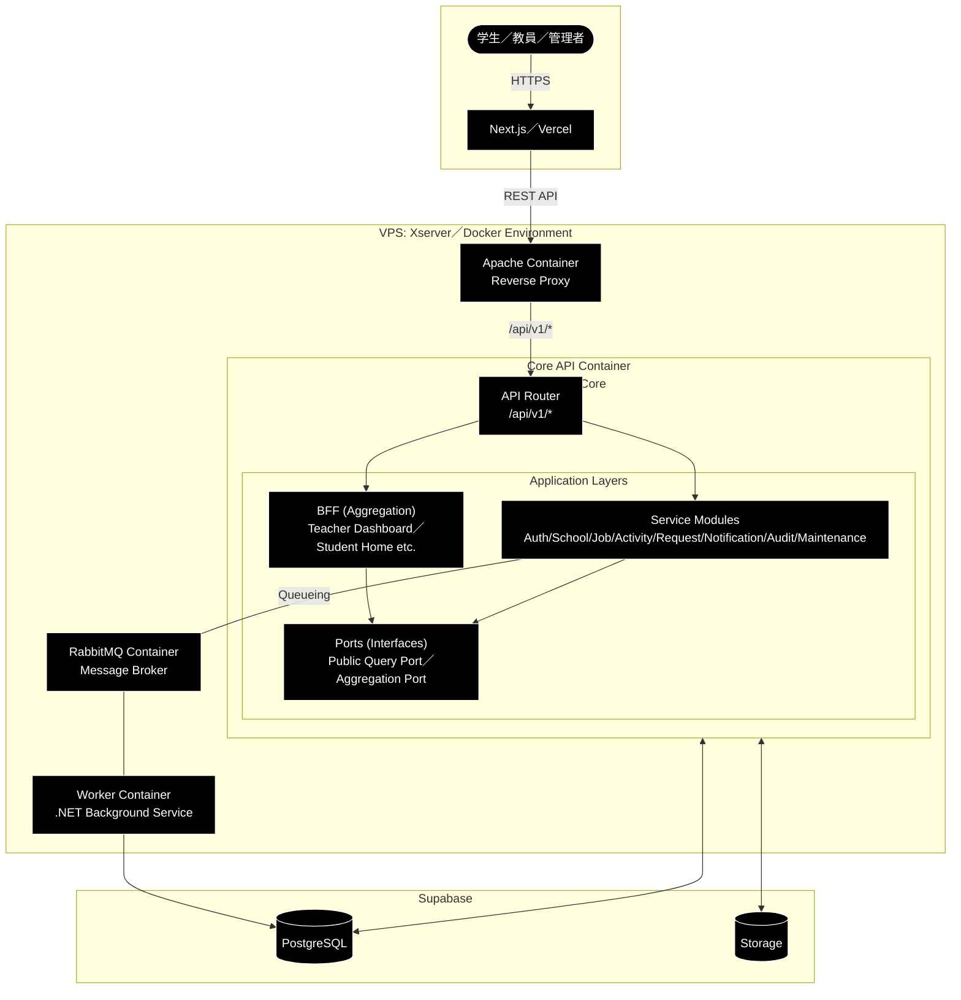

# アーキテクチャ設計書：SenLink（センリンク）

## 1. システム概要
SenLinkは、学生・教員・管理者をシームレスに繋ぐプラットフォームです。  
フロントエンドはVercel、バックエンドはXserver VPS上のDocker環境、データ層はSupabase（PostgreSQL／Storage）を利用します。

- **Core API**：Auth／School／Job／Activity／Request／Notification／Audit／Maintenance のAPIを提供  
- **BFF API（Backend For Frontend API）**：Core API 内の集約層として実装し、画面に必要な情報を複数サービスから結合して返す  
- **Apache**：Reverse Proxy／IP制限／セキュリティ制御

> 方針：  
集約APIは「各サービスの通常のAPIをHTTPで呼ぶ」のではなく、Core内で定義したインターフェース（Port）経由で取得する  

## 1-1. 全体構成図

---

## 2. インフラ構成

### 2-1. ネットワーク
1. **User** → HTTPS → **Next.js（Vercel）**
2. **Vercel** → API Request → **Apache（VPS）**
3. **Apache** → Reverse Proxy → **Core API（ASP.NET Core Web API）**
4. **Core API** → Data Access → **Supabase（PostgreSQL／Storage）**
5. **非同期処理**：Core API → RabbitMQ → Worker → DB更新／通知送信

### 2-2. Dockerコンテナ構成
VPS内は以下のコンテナで構成されます。

| コンテナ名 | イメージ/ベース | 役割 |
| :--- | :--- | :--- |
| **Apache** | httpd:alpine | Reverse Proxy／IP制限／セキュリティ制御 |
| **Core API** | python:3.x-slim | 各サービスの基礎API + BFF（集約API）を同一アプリ内で提供 |
| **RabbitMQ** | rabbitmq:management | 非同期タスクのキュー管理 |
| **Worker** | python:3.x-slim | 通知送信・監査ログ記録等を実行 |

---

## 3. アプリケーション層

### 3-1. Core API
- 各サービスの責務に沿ったエンドポイントを提供
- 単体で意味があるAPIを中心に実装（CRUD／検索／状態遷移など）
- 認証方式：Cookie（HttpOnly） + JWT

### 3-2. BFF API
- 画面要件に合わせて**複数サービスのデータを集計・結合**して返す
- 例：教員ダッシュボード、学生ホーム、学生詳細、求人詳細（画面DTO）

#### 3-2-1. 依存関係の原則
- BFFは**集約用インターフェース**のみ参照する
- 各サービスはBFFを参照しない（import禁止）

#### 3-2-2. Port の種類（推奨）
- **Public Query Port（各サービスが提供）**  
  - 例：SchoolPublicQuery／ActivityPublicQuery／RequestPublicQuery など「他ドメイン・集約が使ってよい最小限の読み取り」を提供する
- **Aggregation Port（BFF側が定義）**  
  - 例：TeacherDashboardQuery／StudentActivitiesOverviewQuery など  
  - 画面DTOを返す “集約ユースケース” を表す

> 補足：集約APIが各サービスのRouter/APIをHTTPで叩く構成にしない理由  
> - 同一プロセス内なのにHTTP化すると無駄なオーバーヘッド／障害点増  
> - 境界は「Port」で守り、実装詳細は隠蔽する（依存関係を綺麗に保つ）

---

## 4. ルーティング仕様
- 各API：
  - `/api/v1/auth/*`
  - `/api/v1/school/*`
  - `/api/v1/job/*`
  - `/api/v1/activity/*`
  - `/api/v1/request/*`
  - `/api/v1/notification/*`
  - `/api/v1/audit/*`
  - `/api/v1/maintenance/*`
  - `/api/v1/bff/*`（集約API）
    - 例：`/api/v1/bff/teacher/dashboard`

> ルーティング上は同一 Core API に入るが、アプリ内で Router を分割し責務を分離する  
> - Core API: `/api/v1/{service}/...`  
> - BFF API: `/api/v1/bff/...`

---

## 5. データ層
Supabaseは以下を利用します。

- **PostgreSQL**
  - リレーショナルデータの保存
  - ASP.NET Core Web API（EF Core）から接続
- **Storage**
  - PDF/画像等の添付ファイルを保存（申請添付、ポートフォリオ等）

---

## 6. 非同期処理の設計方針
即時レスポンスが不要または重負荷な処理はWorkerへ委譲します。

1. **API受付**：Core API がリクエストを受け、RabbitMQにタスクをpublish
2. **即時応答**：ユーザーへ受付完了を返す
3. **タスク実行**：WorkerがQueueを購読し、Audit記録やNotification送信を実行
4. **反映**：必要に応じてDB更新

### 6-1. 集約と非同期の扱い
- BFF は原則、読み取りの集計/整形が主であり、**キュー処理は基本しない**
- 重い集計を避けたい場合に限り、**事前集計テーブル（Read Model）** を作り Worker で更新する方式を検討する

---

## 7. セキュリティ
- 学内IP制限：学外は **403**（Apache側で制御）
- 認証方式：**Cookie（HttpOnly） + JWT**
- 権限：role（0=学生／1=教員／2=管理者）
- BFFも同様にJWTを検証し、対象ロールを判定する（教員向けは role=1/2 のみ等）