# データベース設計書：SenLink（センリンク）

## 目次
1. [テーブル一覧](#1-テーブル一覧)
2. [ER図](#2-er図)   
3. [Auth サービス](#3-auth-サービス)
4. [School サービス](#4-school-サービス)
5. [Job サービス](#5-job-サービス)
6. [Activity サービス](#6-activity-サービス)
7. [Request サービス](#7-request-サービス)
8. [Notification サービス](#8-notification-サービス)
9. [Audit サービス](#9-audit-サービス)
10. [Maintenance サービス](#10-maintenance-サービス)

## 1. テーブル一覧
| No | サービス名 | テーブル名 | 論理名 | 説明 |
| :--- | :---- | :--- | :--- | :--- |
| 1 | `Auth` | `accounts` | アカウント | 認証基盤、ロール管理 |
| 2 | | `login_histories` | ログイン履歴 | アクセス元情報の記録 |
| 3 | `School` | `teachers` | 教員 | 教員プロフィール情報 |
| 4 | | `students` | 学生 | 学生プロフィール、学籍情報 |
| 5 | | `departments` | 学科 | 学科マスタ |
| 6 | | `classes` | クラス | クラスマスタ |
| 7 | | `class_teachers` | クラス担任 | 教員とクラスの紐付け |
| 8 | `Job` | `companies` | 企業 | 企業基本情報 |
| 9 | | `jobs` | 求人 | 求人、説明会、試験情報 |
| 10 | | `tags` | タグ | 特徴、職種分類 |
| 11 | | `job_tags` | 求人タグ | 求人とタグの中間テーブル |
| 12 | | `job_recommendations`| レコメンド | 教員から学生への推奨 |
| 13 | | `job_target_classes` | 公開対象クラス | クラス単位の公開制限 |
| 14 | | `job_target_students` | 公開対象学生 | 特定学生への限定公開 |
| 15 | | `bookmarks` | ブックマーク | 学生の気になるリスト |
| 16 | | `surveys` | アンケート定義 | 案件ごとの質問項目 |
| 17 | | `survey_responses` | アンケート回答 | 学生の回答データ |
| 18 | | `todo_templates` | ToDo型 | ToDoリストの雛形 |
| 19 | | `todo_steps` | ToDoステップ | 工程ごとの具体的タスク |
| 20 | `Activity` | `activities` | 就職活動 | 応募状況、選考ステータス |
| 21 | | `activity_todos` | 個別ToDo | 学生ごとの進捗管理 |
| 22 | `Request` | `requests` | 汎用申請 | 書類・面接・内定等の全申請 |
| 23 | | `request_comments` | 申請コメント | 添削指導、日程調整のやり取り |
| 24 | | `request_attachments` | 申請添付資料 | 履歴書PDFや内定証拠画像 |
| 25 | `Notification` | `notifications` | 通知 | 受信履歴、既読管理 |
| 26 | `Notification` | `notification_deliveries` | 送達状態 | チャネル別の送達状態管理 |
| 27 | `Notification` | `account_line_links` | LINE連携 | アカウントごとのLINE連携管理 |
| 28 | `Notification` | `notification_preferences` | 受信設定 | 受信チャネルON/OFF管理 |
| 29 | `Audit` | `audit_logs` | 監査ログ | ユーザーの操作履歴 |
| 30 | | `error_logs` | エラーログ | システム例外の記録 |
| 31 | | `system_metrics` | システムメトリクス | リソース・応答速度監視 |
| 32 | `Maintenance` | `system_settings` | システム設定 | マスタデータ、管理フラグ |

## 共通ルール
全てのテーブルには、以下の2つのカラムが含まれるものとします（表では省略します）。
| カラム名 | データ型 | 制約 | デフォルト値 | 説明 |
|:---|:---|:---|:---|:---|
| created_at | TIMESTAMP | NN | CURRENT_TIMESTAMP | 作成日時 |
| updated_at | TIMESTAMP | NN | CURRENT_TIMESTAMP | 更新日時 |

## 制約ルール
* **PK**: 主キー
* **FK**: 外部キー（**同一サービス内のテーブルのみ**参照可能）
* **NOFK**: 論理参照（**他サービスのID**を参照。DB上の制約はなし）
* **UQ**: Unique制約（単一/複合どちらもあり）
* **NN**: Not Null制約

## 2. ER図

```mermaid
erDiagram
    %% Auth Service
    accounts ||--o{ login_histories : "ログイン記録"

    %% School Service
    departments ||--o{ classes : "所属"
    classes ||--o{ students : "所属"
    classes ||--o{ class_teachers : "構成"
    teachers ||--o{ class_teachers : "担当"

    %% Job Service
    companies ||--o{ jobs : "掲載"
    jobs ||--o{ job_tags : "タグ付け"
    tags ||--o{ job_tags : "定義"
    jobs ||--o{ surveys : "所持"
    surveys ||--o{ survey_responses : "回答受付"
    todo_templates ||--o{ todo_steps : "構成"
    jobs }|--|| todo_templates : "使用"
    jobs ||--o{ job_recommendations : "レコメンド"
    jobs ||--o{ bookmarks : "ブックマーク"
    jobs ||--o{ job_target_classes : "公開対象(クラス)"
    jobs ||--o{ job_target_students : "公開対象(学生)"

    %% Activity Service
    activities ||--o{ activity_todos : "ToDo"

    %% Request Service
    requests ||--o{ request_comments : "コメント"
    requests ||--o{ request_attachments : "添付"

    %% Notification Service
    accounts ||--o{ notifications : "受信"
    notifications ||--o{ notification_deliveries : "配信"
    accounts ||--o| account_line_links : "LINE連携"
    accounts ||--|| notification_preferences : "通知設定"

    %% Audit Service（論理参照）
    accounts ||--o{ audit_logs : "操作"
    accounts ||--o{ error_logs : "エラー発生"

    %% Cross-Service（論理参照・NOFK）
    accounts ||--|| teachers : "教員アカウント"
    accounts ||--|| students : "学生アカウント"

    students ||--o{ activities : "活動実施"
    jobs ||--o{ activities : "応募対象"

    accounts ||--o{ job_recommendations : "学生/教員"
    accounts ||--o{ bookmarks : "学生"

    accounts ||--o{ requests : "申請者/承認者"
    accounts ||--o{ request_comments : "コメント投稿者"
    accounts ||--o{ request_attachments : "添付投稿者(間接)"
```

## 3. Auth サービス
認証／認可、JWTの発行／検証、ロールベースアクセス制御（RBAC）

### 3-1. accounts（アカウント）
| カラム名 | データ型 | 制約 | デフォルト値 | 説明 |
|:---------|:---------|:-----|:-------------|:-----|
| id | BIGINT | PK | GENERATED | ID |
| email | VARCHAR（255） | UQ, NN | - | メールアドレス |
| password | VARCHAR（255） | NN | - | パスワード（Hash） |
| role | SMALLINT | NN | - | 0:学生／1:教員／2:管理者 |
| is_active | BOOLEAN | NN | - | 有効フラグ |
| deleted_at | TIMESTAMP | - | NULL | 論理削除 |

### 3-2. login_histories（ログイン履歴）
| カラム名 | データ型 | 制約 | デフォルト値 | 説明 |
|:---------|:---------|:-----|:-------------|:-----|
| id | BIGINT | PK | GENERATED | ID |
| account_id | BIGINT | FK, NN | - | アカウントID（accounts.id） |
| ip_address | VARCHAR（45） | - | NULL | IPアドレス |
| user_agent | TEXT | - | NULL | ブラウザ情報 |
| status | SMALLINT | NN | - | 0:失敗／1:成功 |

## 4. School サービス
学校情報の管理（学科、クラス、教員／学生データ）

### 4-1. teachers（教員）
| カラム名 | データ型 | 制約 | デフォルト値 | 説明 |
|:---------|:---------|:-----|:-------------|:-----|
| id | BIGINT | PK | GENERATED | ID |
| account_id | BIGINT | NOFK, UQ, NN | - | アカウントID（accounts.id） |
| name | VARCHAR（100） | NN | - | 氏名 |
| name_kana | VARCHAR（100） | NN | - | 氏名カナ（検索／ソート用） |
| title | VARCHAR（50） | - | NULL | 役職 |
| office_location | VARCHAR（100） | - | NULL | オフィス場所（例: 201号室） |
| profile_data | JSONB | - | NULL | 詳細プロフィール（経歴、専門分野など） |

### 4-2. students（学生）
| カラム名 | データ型 | 制約 | デフォルト値 | 説明 |
|:---------|:---------|:-----|:-------------|:-----|
| id | BIGINT | PK | GENERATED | ID |
| account_id | BIGINT | NOFK, UQ, NN | - | アカウントID（accounts.id） |
| class_id | BIGINT | FK, NN | - | クラスID |
| student_number | VARCHAR（20） | UQ, NN | - | 学籍番号 |
| name | VARCHAR（100） | NN | - | 氏名 |
| name_kana | VARCHAR（100） | NN | - | 氏名カナ（検索／ソート用） |
| date_of_birth | DATE | NN | - | 生年月日 |
| gender | SMALLINT | NN | 0 | 0:不明／1:男／2:女／9:その他 |
| admission_year | INT | NN | - | 入学年度 |
| is_job_hunting | BOOLEAN | NN | TRUE | 就活中フラグ |
| profile_data | JSONB | - | NULL | PR、資格、リンクなど |

### 4-3. departments（学科）
| カラム名 | データ型 | 制約 | デフォルト値 | 説明 |
|:---------|:---------|:-----|:-------------|:-----|
| id | BIGINT | PK | GENERATED | ID |
| name | VARCHAR（100） | NN | - | 学科名 |
| code | VARCHAR（20） | NN | - | 学科コード |

### 4-4. classes（クラス）
| カラム名 | データ型 | 制約 | デフォルト値 | 説明 |
|:---------|:---------|:-----|:-------------|:-----|
| id | BIGINT | PK | GENERATED | ID |
| department_id | BIGINT | FK, NN | - | 学科ID（departments.id） |
| fiscal_year | SMALLINT | NN | - | 年度  |
| grade | SMALLINT | NN | - | 学年 |
| name | VARCHAR（50） | NN | - | クラス名（例: A組／午前クラス） |

### 4-5. class_teachers（クラス担任）
| カラム名 | データ型 | 制約 | デフォルト値 | 説明 |
|:---------|:---------|:-----|:-------------|:-----|
| id | BIGINT | PK | GENERATED | ID |
| class_id | BIGINT | FK, NN | - | クラスID |
| teacher_id | BIGINT | FK, NN | - | 教員ID（teachers.id） |
| role | SMALLINT | NN | - | 0:担任／1:副担任／3:キャリアセンター／9:その他 |
**制約（表外）：UQ（class_id, teacher_id）**

## 5. Job サービス
求人情報の管理、企業情報、求人ToDoテンプレート

### 5-1. companies（企業）
| カラム名 | データ型 | 制約 | デフォルト値 | 説明 |
|:---------|:---------|:-----|:-------------|:-----|
| id | BIGINT | PK | GENERATED | ID |
| name | VARCHAR（255） | NN | - | 企業名 |
| address | VARCHAR（255） | - | NULL | 所在地 |
| url | VARCHAR（255） | - | NULL | URL |

### 5-2. jobs（求人）
| カラム名 | データ型 | 制約 | デフォルト値 | 説明 |
|:---------|:---------|:-----|:-------------|:-----|
| id | BIGINT | PK | GENERATED | ID |
| company_id | BIGINT | FK, NN | - | 企業ID（companies.id） |
| todo_template_id | BIGINT | FK, NN | - | ToDoテンプレートID（todo_templates.id） |
| teacher_account_id | BIGINT | NOFK, NN | - | 教員ID（accounts.id） |
| title | VARCHAR（255） | NN | - | 管理用案件名 |
| type | SMALLINT | NN | - | 0:説明会／1:インターン／2:採用試験 |
| capacity | INT | - | NULL | 定員数 |
| format | SMALLINT | NN | - | 0:対面／1:オンライン／2:ハイブリッド |
| place | VARCHAR（255） | - | NULL | 開催場所・URL |
| contact_info | VARCHAR（255） | - | NULL | 緊急連絡先 |
| event_start_date | DATE | - | NULL | 開催日／開始日 |
| event_end_date | DATE | - | NULL | 終了日 |
| cancel_deadline | DATE | - | NULL | キャンセル期限日 |
| status | SMALLINT | - | - | 0:下書き／1:公開／9:終了 |
| publish_scope | SMALLINT | NN | 0 | 0:全体／1:クラス／2:個別 |
| content | TEXT | NN | - | 企業紹介／募集要項 |
| deadline | DATE | - | NULL | 掲載終了日 |
| deleted_at | TIMESTAMP | - | NULL | 論理削除 |

### 5-3. tags（タグ）
| カラム名 | データ型 | 制約 | デフォルト値 | 説明 |
|:---------|:---------|:-----|:-------------|:-----|
| id | BIGINT | PK | GENERATED | ID |
| name | VARCHAR（50） | NN | - | タグ名 |
| type | SMALLINT | NN | - | 0:職種／1:勤務地／3:特徴／4:必要なもの |

### 5-4. job_tags（求人タグ中間テーブル）
| カラム名 | データ型 | 制約 | デフォルト値 | 説明 |
|:---------|:---------|:-----|:-------------|:-----|
| id | BIGINT | PK | GENERATED | ID |
| job_id | BIGINT | FK, NN | - | 求人ID（jobs.id） |
| tag_id | BIGINT | FK, NN | - | タグID（tags.id） |

### 5-5. job_recommendations（求人レコメンド）
| カラム名 | データ型 | 制約 | デフォルト値 | 説明 |
|:---------|:---------|:-----|:-------------|:-----|
| id | BIGINT | PK | GENERATED | ID |
| job_id | BIGINT | FK, NN | - | 求人ID（jobs.id） |
| student_account_id | BIGINT | NOFK, NN | - | 学生ID（accounts.id） |
| recommender_account_id | BIGINT | NOFK, NN | - | 教員ID（accounts.id） |

### 5-6. job_target_classes（求人公開対象クラス）
| カラム名 | データ型 | 制約 | デフォルト値 | 説明 |
|:---------|:---------|:-----|:-------------|:-----|
| id | BIGINT | PK | GENERATED | ID |
| job_id | BIGINT | FK, NN | - | 求人ID（jobs.id） |
| class_id | BIGINT | NOFK, NN | - | クラスID（classes.id） |
**制約：UQ（job_id, class_id）**

### 5-7. job_target_students（求人公開対象学生）
| カラム名 | データ型 | 制約 | デフォルト値 | 説明 |
|:---------|:---------|:-----|:-------------|:-----|
| id | BIGINT | PK | GENERATED | ID |
| job_id | BIGINT | FK, NN | - | 求人ID（jobs.id） |
| student_account_id | BIGINT | NOFK, NN | - | 学生アカウントID（accounts.id） |
**制約：UQ（job_id, student_account_id）**

### 5-8. bookmarks（ブックマーク）
| カラム名 | データ型 | 制約 | デフォルト値 | 説明 |
|:---------|:---------|:-----|:-------------|:-----|
| id | BIGINT | PK | GENERATED | ID |
| job_id | BIGINT | FK, NN | - | 求人ID（jobs.id）|
| student_account_id | BIGINT | NOFK, NN | - | 学生ID（account.id） |
 **制約：UQ（job_id, student_account_id）**

### 5-9. surveys（アンケート定義）
| カラム名 | データ型 | 制約 | デフォルト値 | 説明 |
|:---------|:---------|:-----|:-------------|:-----|
| id | BIGINT | PK | GENERATED | ID |
| job_id | BIGINT | FK, NN | - | 求人ID（jobs.id） |
| title | VARCHAR（255） | NN | - | アンケート名 |
| questions | JSONB | NN | - | 質問項目 |

### 5-10. survey_responses（アンケート回答）
| カラム名 | データ型 | 制約 | デフォルト値 | 説明 |
|:---------|:---------|:-----|:-------------|:-----|
| id | BIGINT | PK | GENERATED | ID |
| survey_id | BIGINT | FK, NN | - | アンケート定義ID（surveys.id） |
| student_account_id | BIGINT | NOFK, NN | - | 学生ID（account.id） |
| answers | JSONB | NN | - | 回答内容 |

### 5-11. todo_templates（ToDoテンプレート）
| カラム名 | データ型 | 制約 | デフォルト値 | 説明 |
|:---------|:---------|:-----|:-------------|:-----|
| id | BIGINT | PK | GENERATED | ID |
| name | VARCHAR（100） | NN | - | テンプレート名 |
| description | TEXT | - | NULL | 説明 |

### 5-12. todo_steps（ToDoステップ）
| カラム名 | データ型 | 制約 | デフォルト値 | 説明 |
|:---------|:---------|:-----|:-------------|:-----|
| id | BIGINT | PK | GENERATED | ID |
| template_id | BIGINT | FK, NN | - | 親テンプレートID（todo_templates.id） |
| name | VARCHAR（100） | NN | - | タスク名 |
| description | TEXT | - | NULL | 指示内容 |
| step_order | INT | NN | - | 順序 |
| days_deadline | INT | - | 0 | 相対期限（日） |
| is_verification_required | BOOLEAN | - | FALSE | 承認必須フラグ 

## 6. Activity サービス
学生の応募状況と活動実績

### 6-1. activities（就職活動）
| カラム名 | データ型 | 制約 | デフォルト値 | 説明 |
|:---------|:---------|:-----|:-------------|:-----|
| id | BIGINT | PK | GENERATED | ID |
| job_id | BIGINT | NOFK, NN | - | 求人ID（jobs.id） |
| student_account_id | BIGINT | NOFK, NN | - | 学生ID（accounts.id） |
| status | SMALLINT | NN | 0 | 0:参加前／1:参加済／2:辞退 |
| reviewed_by_account_id | BIGINT | NOFK | NULL | 教員ID（accounts.id） |
**制約（表外）：UQ（job_id, student_account_id）**

### 6-2. activity_todos（就職活動ToDo）
| カラム名 | データ型 | 制約 | デフォルト値 | 説明 |
|:---------|:---------|:-----|:-------------|:-----|
| id | BIGINT | PK | GENERATED | ID |
| activity_id | BIGINT | FK, NN | - | 就活ID（activities.id） |
| name | VARCHAR（100） | NN | - | タスク名 |
| description | TEXT | - | NULL | 指示内容 |
| step_order | INT | NN | - | 順序 |
| status | SMALLINT | NN | 0 | 0:未完了／1:完了／ |
| deadline | DATE | NN | - | 期限日 |
| completed_at | TIMESTAMP | - | NULL | 完了日時 |

## 7. Request サービス
学生の各種申請と教員のステート管理

### 7-1. requests
| カラム名 | データ型 | 制約 | デフォルト値 | 説明 |
|:--|:--|:--|:--|:--|
| id | BIGINT | PK | GENERATED | 申請ID |
| requester_account_id | BIGINT | NOFK, NN | - | 申請者ID（accounts.id） |
| reviewer_account_id | BIGINT | NOFK  | NULL | 承認/差し戻し担当ID（accounts.id） |
| type | SMALLINT | NN | - | 0:書類提出／1:面接予約／2:合否発表 |
| status | SMALLINT | NN | 0 | 0:下書き／1:申請中／2:承認／3:差し戻し |
| title | VARCHAR(255) | NN | - | 一覧表示用（例：履歴書提出、面接予約申請） |
| payload | JSONB | NN | - | 種別ごとの入力内容 |
| submitted_at | TIMESTAMP | - | NULL | 申請送信日時（下書き→申請中の瞬間） |
| resolved_at | TIMESTAMP | - | NULL | 承認/差し戻し確定日時 |

### 7-2. request_comments
| カラム名 | データ型 | 制約 | デフォルト値 | 説明 |
|:--|:--|:--|:--|:--|
| id | BIGINT | PK | GENERATED | コメントID |
| request_id | BIGINT | FK, NN | - | 申請ID（requests.id） |
| author_account_id | BIGINT | NOFK, NN | - | 投稿者ID（accounts.id） |
| comment_type | SMALLINT | NN | - | 0:メッセージ／1:承認／2:差し戻し |
| body | TEXT | NN | - | コメント本文 |

## 7-3. request_attachments（添付資料）
| カラム名 | データ型 | 制約 | デフォルト値 | 説明 |
|:--|:--|:--|:--|:--|
| id | BIGINT | PK | GENERATED | 添付ID |
| request_id | BIGINT | FK, NN | - | 申請ID（requests.id） |
| file_path | VARCHAR(255) | NN | - | Storage上のパス |
| file_type | SMALLINT | NN | 0 | 0:書類／1:画像／9:その他 |
| description | VARCHAR(255) | - | NULL | 補足 |
**制約（表外）：UQ（request_id, file_path）**

### 8. Notification サービス
プッシュ通知とメール送信の制御

## 8-1. notifications（通知）
| カラム名 | データ型 | 制約 | デフォルト値 | 説明 |
|:---------|:---------|:-----|:-------------|:-----|
| id | BIGINT | PK | GENERATED | ID |
| recipient_account_id | BIGINT | FK, NN | - | 受信者ID（accounts.id） |
| title | VARCHAR(255) | NN | - | タイトル |
| body | TEXT | - | NULL | 本文 |
| link_url | VARCHAR(255) | - | NULL | 遷移URL |
| type | SMALLINT | NN | - | 0:システム／1:申請／2:求人／3:活動／4:催促／5:レコメンド／9:その他 |
| read_status | SMALLINT | NN | 0 | 0:未読／1:既読 ||

## 8-2. notification_deliveries（送達状態）
| カラム名 | データ型 | 制約 | デフォルト値 | 説明 |
|:---------|:---------|:-----|:-------------|:-----|
| id | BIGINT | PK | GENERATED | ID |
| notification_id | BIGINT | FK, NN | - | notifications.id |
| recipient_account_id | BIGINT | FK, NN | - | 受信者ID（検索用） |
| channel | SMALLINT | NN | - | 0:通知センター／1:メール／2:LINE |
| status | SMALLINT | NN | 0 | 0:送信前／1:送信済／2:失敗 |
| provider_message_id | VARCHAR(128) | - | NULL | 外部事業者のメッセージID（LINE messageId等） |
| error_type | VARCHAR(64) | - | NULL | 失敗種別（例：LINE_BLOCKED / RATE_LIMIT 等） |
| error_message | TEXT | - | NULL | エラー詳細 |
| attempt_count | INT | NN | 0 | 送信試行回数 |
| next_retry_at | TIMESTAMP | - | NULL | 次回リトライ時刻 |

## 8-3. account_line_links（LINE連携）
| カラム名 | データ型 | 制約 | デフォルト値 | 説明 |
|:---------|:---------|:-----|:-------------|:-----|
| id | BIGINT | PK | GENERATED | ID |
| account_id | BIGINT | FK, NN, UNIQUE | - | accounts.id |
| line_user_id | VARCHAR(64) | NN | - | LINEのユーザーId（送信に必須） |
| status | SMALLINT | NN | 0 | 0:未連携／1:連携済／2:解除 |
| linked_at | TIMESTAMP | - | NULL | 連携日時 |
| unlinked_at | TIMESTAMP | - | NULL | 解除日時 |
**制約（表外）：UQ（account_id, line_user_id）**

## 8-4. notification_preferences（受信管理）
| カラム名 | データ型 | 制約 | デフォルト値 | 説明 |
|:---------|:---------|:-----|:-------------|:-----|
| account_id | BIGINT | PK, FK, NN | - | accounts.id |
| in_app_enabled | BOOLEAN | NN | true | 通知センター |
| email_enabled | BOOLEAN | NN | true | メール |
| line_enabled | BOOLEAN | NN | false | LINE |
| mute_all | BOOLEAN | NN | false | 全停止 |

## 9. Audit サービス
操作ログの記録、証跡管理

### 9-1. audit_logs（監査ログ）
| カラム名 | データ型 | 制約 | デフォルト値 | 説明 |
|:---------|:---------|:-----|:-------------|:-----|
| id | BIGINT | PK | GENERATED | ID |
| actor_id | BIGINT | NOFK, NN | - | 操作者ID（accounts.id） |
| target_table | VARCHAR（50） | NN | - | 対象テーブル名 |
| target_id | BIGINT | NN | - | 対象ID |
| method | VARCHAR（50） | NN | - | 操作種別（CREATE/UPDATE/DELETE等） |
| details | JSONB | - | NULL | 変更前後のデータ |
| ip_address | VARCHAR（45） | - | NULL | IPアドレス |

### 9-2. error_logs（エラーログ）
| カラム名 | データ型 | 制約 | デフォルト値 | 説明 |
|:---------|:---------|:-----|:-------------|:-----|
| id | BIGINT | PK | GENERATED | ID |
| service_name| VARCHAR（50） | NN | - | 発生元サービス（Auth, Job, Worker等） |
| severity | SMALLINT | NN | - | 0:Warn／1:Error／2:Critical |
| message | TEXT | NN | -| エラーメッセージの要約 |
| stack_trace | TEXT | - | - | 詳細なスタックトレース（デバッグ用） |
| request_url | TEXT | - | - | 発生時のAPIエンドポイントURL |
| request_params| JSONB | - | - | 発生時のリクエストボディ、クエリ等 |
| account_id | BIGINT | NOFK | - | 発生時にログインしていたアカウント |

### 9-3. system_metrics（システムメトリクス）
| カラム名 | データ型 | 制約 | デフォルト値 | 説明 |
|:---------|:---------|:-----|:-------------|:-----|
| id | BIGINT | PK | GENERATED | ID |
| component | VARCHAR（50） | NN | - | Apache／FastAPI／Worker / RabbitMQ |
| status | SMALLINT | NN | - | 0:Down／1:Healthy／2:HighLoad |
| response_time| INT | - | -| 平均レスポンス速度（ms） |
| cpu_usage | NUMERIC（5,2）| - | - | CPU使用率（%） |
| mem_usage | NUMERIC（5,2）| - | - | メモリ使用率（%） |
| disk_usage | NUMERIC（5,2）| - | - | ディスク使用率（%） |

## 10. Maintenance サービス
システムの設定値変更と状態管理

### 10-1. system_settings（システム設定）
| カラム名 | データ型 | 制約 | デフォルト値 | 説明 |
|:---------|:---------|:-----|:-------------|:-----|
| id | BIGINT | PK | GENERATED | ID |
| key | VARCHAR（50） | UQ, NN | - | 設定キー |
| value | TEXT | NN | - | 設定値 |
| description | VARCHAR（255） | - | NULL | 説明 |

### 10-2. delivery_reservations（配信予約）
| カラム名 | データ型 | 制約 | デフォルト値 | 説明 |
|:---------|:---------|:-----|:-------------|:-----|
| id | BIGINT | PK | GENERATED | ID |
