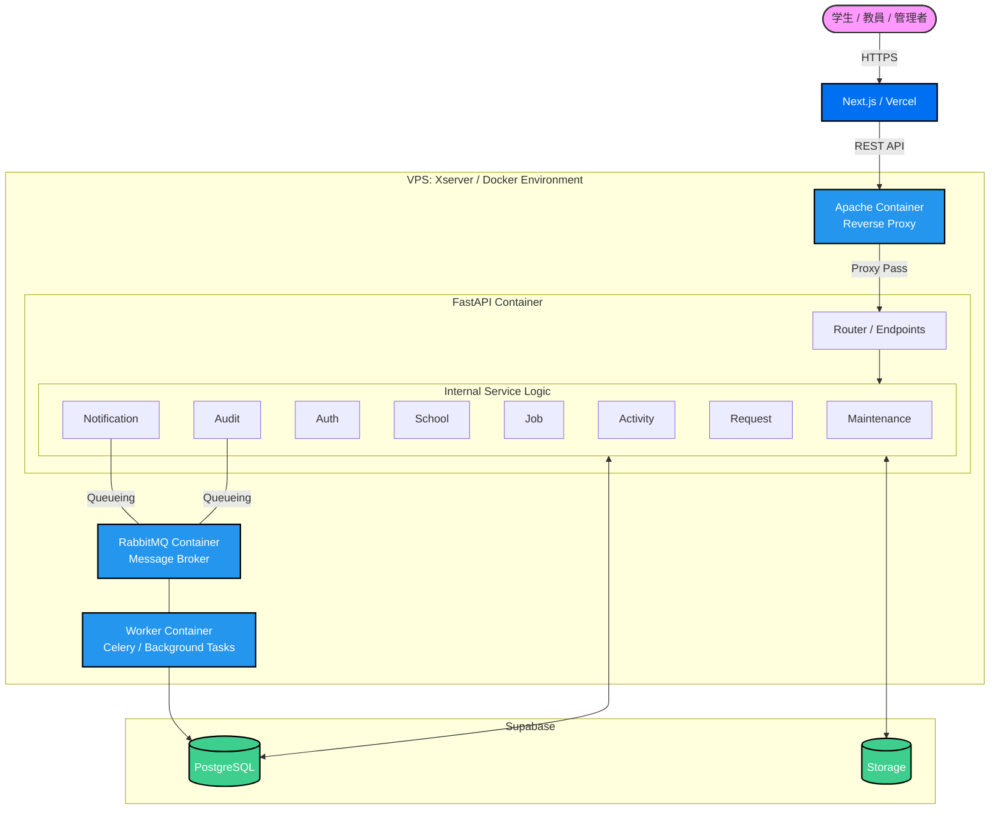

# アーキテクチャ設計書：SenLink（センリンク）

## 1. システム概要
SenLinkは、学生・教員・管理者をシームレスに繋ぐプラットフォームです。 
フロントエンドはVercel、バックエンドはXserver VPS上のDocker環境、データ層はSupabaseを利用した構成を採用します。

---

## 2. インフラ構成

### 2.1 ネットワークフロー
1. **User** → HTTPS (Next.js / Vercel)
2. **Vercel** → API Request (REST / JWT) → **Apache (VPS)**
3. **Apache** → Reverse Proxy → **FastAPI (Docker Container)**
4. **FastAPI** → Queueing → **RabbitMQ** → **Worker**
5. **FastAPI / Worker** → Data Access → **Supabase (DB & Storage)**

### 2.2 Dockerコンテナ構成 (Xserver VPS)
VPS内は以下の4つのコンテナで構成されます。

| コンテナ名 | イメージ/ベース | 役割 |
| :--- | :--- | :--- |
| **Apache** | httpd:alpine | リバースプロキシ、SSL終端、FastAPIへのリクエスト転送。 |
| **FastAPI** | python:3.x-slim | メインのAPIアプリケーション。8つのビジネスロジックを保持。 |
| **RabbitMQ** | rabbitmq:management | メッセージブローカー。非同期タスクのキュー管理。 |
| **Worker** | python:3.x-slim | Celery等を用いた非同期処理実行器（通知・ログ記録等）。 |

---

## 3. アプリケーション層 (FastAPI サービス詳細)

FastAPI内部は、関心の分離（SoC）に基づき、以下の8つのサービスモジュールで構成されます。

| サービス名 | 内容 |
| :--- | :--- |
| **Maintenance** | システムのメンテナンス状態管理、バージョン整合性チェック。 |
| **Audit** | 操作ログの記録、証跡管理（Worker経由で非同期実行）。 |
| **Auth** | 認証・認可、JWTの発行・検証、ロールベースアクセス制御（RBAC）。 |
| **School** | 学校情報の管理（学科、クラス、所属教員・学生データ）。 |
| **Job** | 求人情報の管理、企業情報、学生の応募ステータス管理。 |
| **Activity** | 学生の活動実績、ポートフォリオ、スキルデータの管理。 |
| **Request** | 各種申請フロー（承認、却下、差し戻し等のステート管理）。 |
| **Notification** | プッシュ通知、メール送信の制御（RabbitMQ/Workerと連携）。 |

---

## 4. データ層 (Supabase)

Supabaseはフル機能のうち、以下の2つのマネージドサービスをリソースとして利用します。

* **PostgreSQL**:
    * リレーショナルデータの保存。
    * FastAPI（SQLAlchemy / Tortoise ORM等）からの直接接続。
* **Storage (Object Storage)**:
    * 学生の証明写真、ポートフォリオ資料（PDF/画像）、求人票等のファイル保存。

---

## 5. 非同期処理の設計方針
即時レスポンスが不要な処理、または重負荷な処理はWorkerコンテナに委譲します。
1. **API受付**: FastAPIがリクエストを受け、RabbitMQにタスクをパブリッシュ。
2. **レスポンス**: ユーザーには即座に「受付完了」を返す。
3. **タスク実行**: WorkerがRabbitMQからキューを購読し、Audit記録やNotification送信を実行。
4. **反映**: 完了後、必要に応じてSupabase DBを更新。