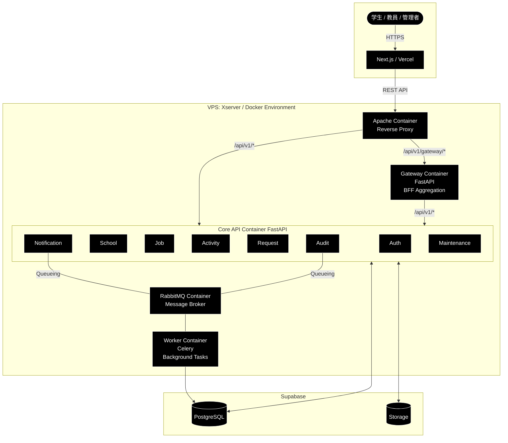

# アーキテクチャ設計書：SenLink（センリンク）【改訂版】

## 1. システム概要
SenLinkは、学生・教員・管理者をシームレスに繋ぐプラットフォームです。  
フロントエンドはVercel、バックエンドはXserver VPS上のDocker環境、データ層はSupabase（PostgreSQL / Storage）を利用します。

本改訂では、**統合（画面最適化）API** を提供する **Gateway（BFF）** を追加し、以下の役割分担を明確化します。

- **Core API（各サービスAPI）**：Auth / School / Job / Activity / Request / Notification / Audit / Maintenance の“基礎API”を提供  
- **Gateway（BFF / 集計API）**：複数サービスの情報を集計・整形して、画面に最適化したレスポンスを提供  
- **Apache**：パスベースで Core / Gateway へルーティング（Reverse Proxy）

## 1-1. 全体構成図

---

## 2. インフラ構成

### 2-1. ネットワークフロー（改訂）
1. **User** → HTTPS → **Next.js（Vercel）**
2. **Vercel** → API Request → **Apache（VPS）**
3. **Apache** → パスベースで振り分け
   - **通常API**：`/api/v1/...` → **Core API（FastAPI）**
   - **統合API**：`/api/v1/gateway/...` → **Gateway（FastAPI / BFF）**
4. **Core API / Gateway** → Data Access → **Supabase（DB / Storage）**
5. **非同期処理**：Core API → RabbitMQ → Worker → DB更新 / 通知送信

---

### 2-2. Dockerコンテナ構成（改訂）
VPS内は以下のコンテナで構成されます。

| コンテナ名 | イメージ/ベース | 役割 |
| :--- | :--- | :--- |
| **Apache** | httpd:alpine | Reverse Proxy / ルーティング / IP制限 / セキュリティ制御 |
| **Core API** | python:3.x-slim | 各サービスの“基礎API”を提供（Auth/School/Job/Activity/Request/Notification/Audit/Maintenance） |
| **Gateway（BFF）** | python:3.x-slim | 画面向け“統合API”を提供（複数サービスの集計・整形） |
| **RabbitMQ** | rabbitmq:management | 非同期タスクのキュー管理 |
| **Worker** | python:3.x-slim | Celery等で通知送信・監査ログ記録等を実行 |

---

## 3. アプリケーション層（FastAPI設計方針：改訂）

### 3-1. Core API（基礎API）
- 各サービスの責務に沿ったエンドポイントを提供
- “単体で意味があるAPI”を中心に実装（CRUD / 検索 / 状態遷移など）
- 認証方式：**Cookie（HttpOnly） + JWT**

### 3-2. Gateway（BFF / 集計API）
- 画面要件に合わせて **複数サービスAPIの結果を集計・結合**して返す
- 例：教員ダッシュボード、学生詳細（プロフ+活動+申請）など
- 原則：**GatewayはCore APIを内部HTTPで呼び出す**（DB直結は避け、境界を崩さない）

---

## 4. ルーティング仕様（Apache：パスベース）

- Core API：
  - ` /api/v1/auth/* `
  - ` /api/v1/school/* `
  - ` /api/v1/job/* `
  - ` /api/v1/activity/* `
  - ` /api/v1/request/* `
  - ` /api/v1/notification/* `
  - ` /api/v1/audit/* `
  - ` /api/v1/maintenance/* `

- Gateway（統合API）：
  - ` /api/v1/gateway/* `
  - 例：`/api/v1/gateway/teacher/dashboard`

---

## 5. データ層（Supabase）
Supabaseは以下を利用します。

- **PostgreSQL**
  - リレーショナルデータの保存
  - FastAPI（SQLAlchemy）から接続
- **Storage**
  - PDF/画像等の添付ファイルを保存（申請添付、ポートフォリオ等）

---

## 6. 非同期処理の設計方針
即時レスポンスが不要または重負荷な処理はWorkerへ委譲します。

1. **API受付**：Core API がリクエストを受け、RabbitMQにタスクをpublish
2. **即時応答**：ユーザーへ受付完了を返す
3. **タスク実行**：WorkerがQueueを購読し、Audit記録やNotification送信を実行
4. **反映**：必要に応じてSupabase DBを更新

※ Gateway は原則 “集計/整形” が主であり、キュー処理はCore API側の責務とする（例外的に重い集計を非同期化する場合のみ検討）

---

## 7. セキュリティ前提（整理）
- 学内IP制限：学外は **403**（Apache側で制御）
- 認証方式：**Cookie（HttpOnly） + JWT**
- 権限：role（0=学生 / 1=教員 / 2=管理者）
- Gatewayも同様にJWTを検証し、対象ロールを判定する（教員向けダッシュボードは role=1/2 のみ等）
