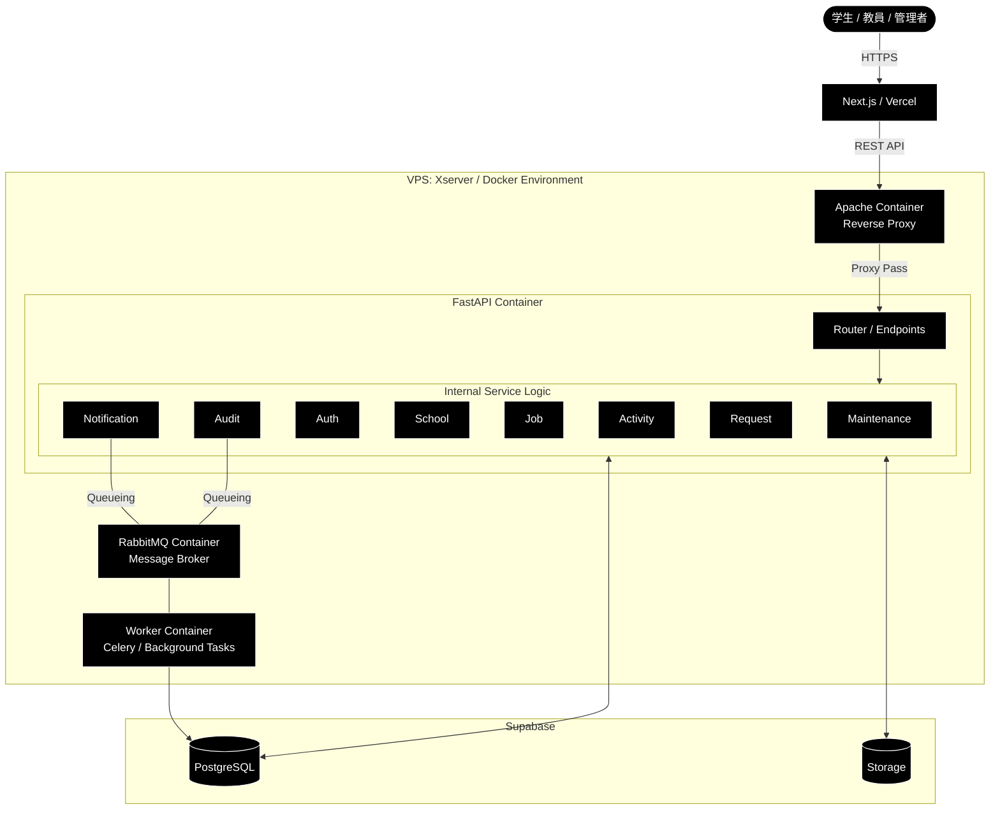

# アーキテクチャ設計書：SenLink（センリンク）

## 1. システム概要
SenLinkは、学生・教員・管理者をシームレスに繋ぐプラットフォームです。 
フロントエンドはVercel、バックエンドはXserver VPS上のDocker環境、データ層はSupabaseを利用した構成を採用します。

## 2. インフラ構成

### 2-1. ネットワークフロー
1. **User** → HTTPS (Next.js / Vercel)
2. **Vercel** → API Request (REST / JWT) → **Apache (VPS)**
3. **Apache** → Reverse Proxy → **FastAPI (Docker Container)**
4. **FastAPI** → Queueing → **RabbitMQ** → **Worker**
5. **FastAPI / Worker** → Data Access → **Supabase (DB & Storage)**

### 2-2. Dockerコンテナ構成 (Xserver VPS)
VPS内は以下の4つのコンテナで構成されます。

| コンテナ名 | イメージ/ベース | 役割 |
| :--- | :--- | :--- |
| **Apache** | httpd:alpine | リバースプロキシ、SSL終端、リクエスト転送、セキュリティー管理。 |
| **FastAPI** | python:3.x-slim | メインのAPIアプリケーション。8つのビジネスロジックを保持。 |
| **RabbitMQ** | rabbitmq:management | メッセージブローカー。非同期タスクのキュー管理。 |
| **Worker** | python:3.x-slim | Celery等を用いた非同期処理実行器（通知・ログ記録等）。 |

## 3. アプリケーション層 (FastAPI サービス詳細)
FastAPI内部は、関心の分離に基づき、以下の8つのサービスモジュールで構成されます。

| サービス名 | 内容 |
| :--- | :--- |
| **Auth** | 認証／認可、JWTの発行／検証、ロールベースアクセス制御（RBAC） |
| **School** | 学校情報の管理（学科、クラス、教員／学生データ） |
| **Job** | 求人情報の管理、企業情報、求人ToDoテンプレート |
| **Activity** | 学生の応募状況と活動実績 |
| **Request** | 学生の各種申請と教員のステート管理 |
| **Notification** | プッシュ通知、メール送信の制御 |
| **Audit** | 操作ログの記録、証跡管理 |
| **Maintenance** | システムの設定値変更と状態管理 |

## 4. データ層 (Supabase)
Supabaseはフル機能のうち、以下の2つのマネージドサービスをリソースとして利用します。

* **PostgreSQL**:
    * リレーショナルデータの保存。
    * FastAPI（SQLAlchemy）からの直接接続。
* **Storage (Object Storage)**:
    * 学生の証明写真、ポートフォリオ資料（PDF/画像）、バックアップを保存。

## 5. 非同期処理の設計方針
即時レスポンスが不要な処理、または重負荷な処理はWorkerコンテナに委譲します。

1. **API受付**: FastAPIがリクエストを受け、RabbitMQにタスクをパブリッシュ。
2. **レスポンス**: ユーザーには即座に「受付完了」を返す。
3. **タスク実行**: WorkerがRabbitMQからキューを購読し、Audit記録やNotification送信を実行。
4. **反映**: 完了後、必要に応じてSupabase DBを更新。